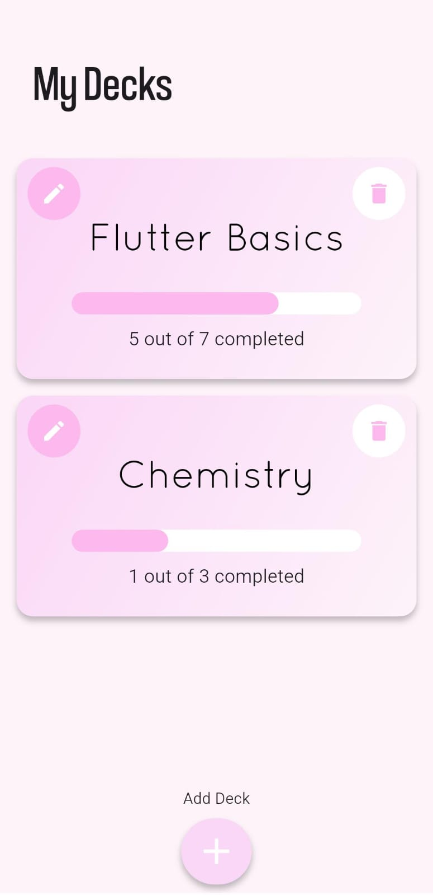
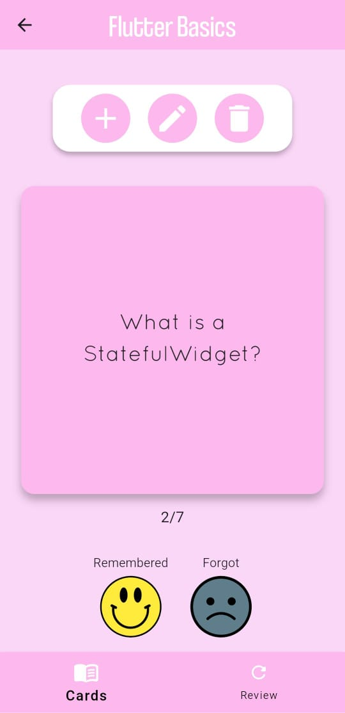
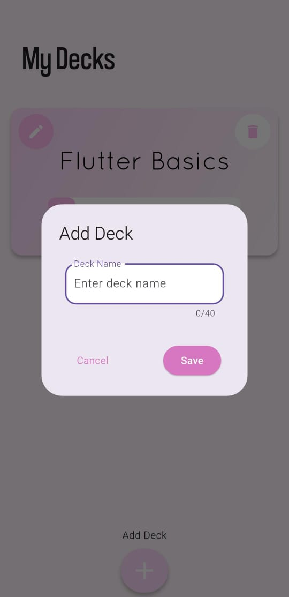
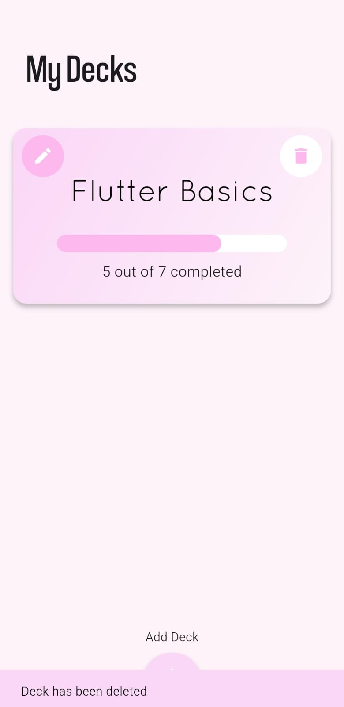
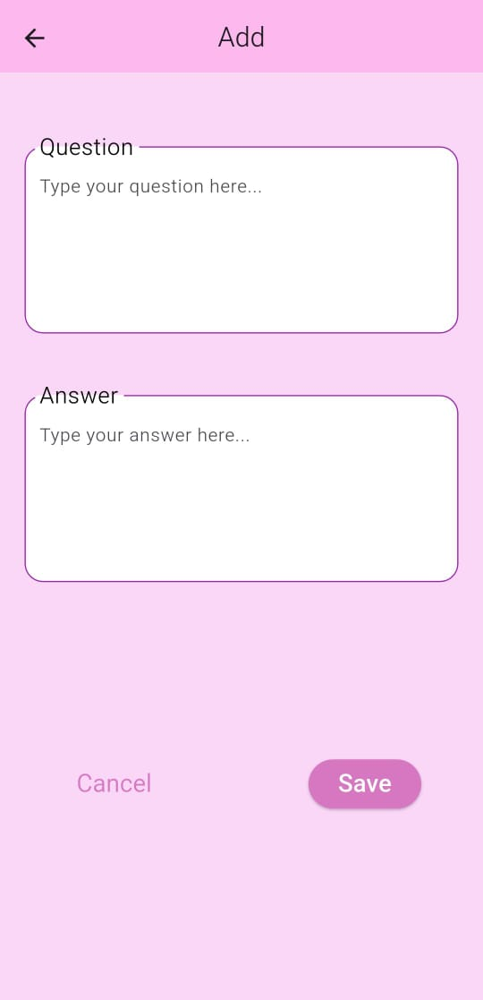
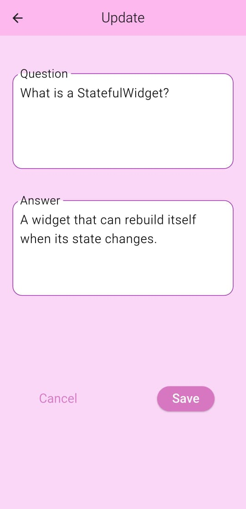
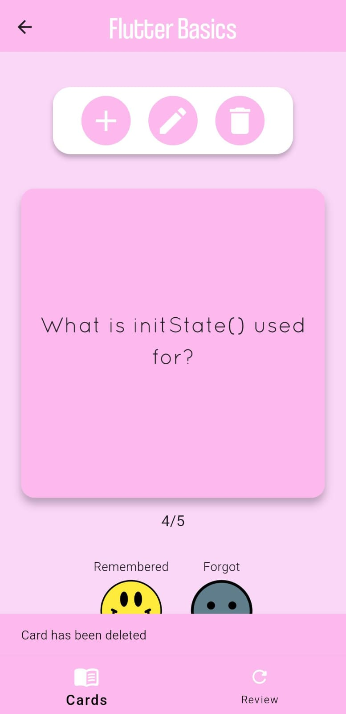
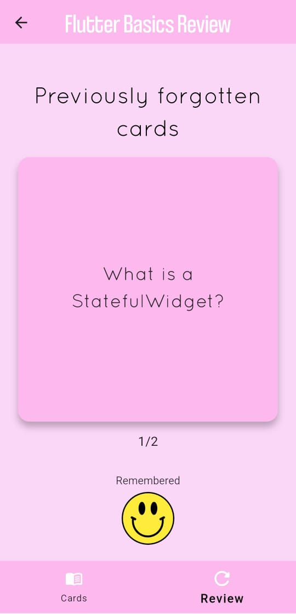
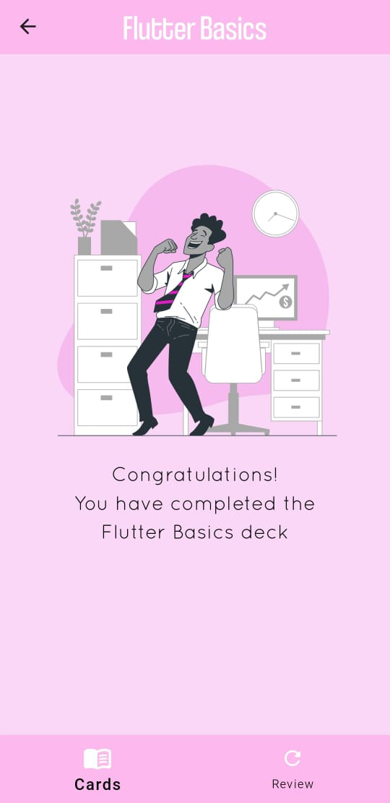

# 📚 FlashCard App

A simple and efficient flashcard app built with **Flutter**. This app helps users create decks, add flashcards, and track their learning progress using a "done" marker. It uses **SQLite** for local data storage.

---

## ✨ Features

- 🔹 Create, edit, and delete decks
- 🔹 Add flashcards with questions and answers
- 🔹 Track your study progress with progress indicators
- 🔹 Review the forgotten cards
- 🔹 Local persistence using SQLite (`sqflite`)
- 🔹 Dummy data added automatically on first launch
- 🔹 Clean and responsive UI

---

## 📸 Screenshots

### 🏠 Home Screen

### 📚 Deck Screen

### 🃏 Card Screen

---

### 📚 Deck Operations

#### ➕ Add Deck

#### ✏️ Edit Deck

#### 🗑️ Delete Deck

---

### 🧠 Card Operations

#### ➕ Add Card

#### ✏️ Edit Card

#### 🗑️ Delete Card

#### 🔄 Review Card

#### 🎉 Completed

## 📦 Dependencies

This app uses the following Flutter packages:

- [`flutter`](https://flutter.dev/)
- [`sqflite`](https://pub.dev/packages/sqflite)
- [`path_provider`](https://pub.dev/packages/path_provider)
- [`path`](https://pub.dev/packages/path) 
- [`flip_card`](https://pub.dev/packages/flip_card) 
- [`flutter_launcher_icons`](https://pub.dev/packages/flutter_launcher_icons) 

