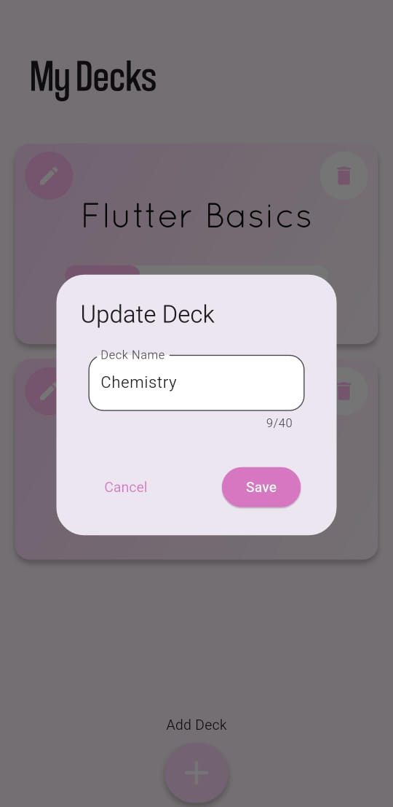

# 📚 FlashCard App

A simple and efficient flashcard app built with **Flutter**. This app helps users create decks, add flashcards, and track their learning progress using a "done" marker. It uses **SQLite** for local data storage.

---

## ✨ Features

- 🔹 Create, edit, and delete decks
- 🔹 Add flashcards with questions and answers
- 🔹 Track your study progress with progress indicators
- 🔹 Review the forgotten cards
- 🔹 Local persistence using SQLite (`sqflite`)
- 🔹 Dummy data added automatically on first launch
- 🔹 Clean and responsive UI

---

## 📸 Screenshots

<table>
  <tr>
    <td align="center">
       
      <b>🏠 Home</b>
    </td>
    <td align="center">
       
      <b>📚 Deck</b>
    </td>
    <td align="center">
       
      <b>🃏 Card</b>
    </td>
  </tr>
</table>

---

### 📚 Deck Operations

<table>
  <tr>
    <td align="center"> <b>➕ Add Deck</b></td>
    <td align="center"> <b>✏️ Edit Deck</b></td>
    <td align="center"> <b>🗑️ Delete Deck</b></td>
  </tr>
</table>

---

### 🧠 Card Operations

<table>
  <tr>
    <td align="center">
       
      <b>➕ Add Card</b>
    </td>
    <td align="center">
       
      <b>✏️ Edit Card</b>
    </td>
    <td align="center">
       
      <b>🗑️ Delete Card</b>
    </td>
    <td align="center">
       
      <b>🔄 Review Card</b>
    </td>
    <td align="center">
       
      <b>🎉 Completed</b>
    </td>
  </tr>
</table>

---

## 📱 Download APK

👉 [Download the latest APK](https://github.com/Zuhayer-Tajbid/Flash-Card-App/releases/tag/v1.0.0.0)

--- 
## 📦 Dependencies

This app uses the following Flutter packages:

- [`flutter`](https://flutter.dev/)
- [`sqflite`](https://pub.dev/packages/sqflite)
- [`path_provider`](https://pub.dev/packages/path_provider)
- [`path`](https://pub.dev/packages/path) 
- [`flip_card`](https://pub.dev/packages/flip_card) 
- [`flutter_launcher_icons`](https://pub.dev/packages/flutter_launcher_icons) 

